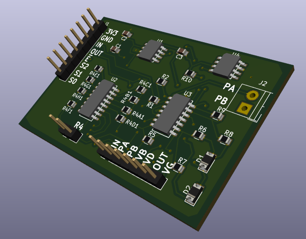

# conductivity-board

- [Conceptual diagram](ref_docs/conductivityCircuit.pdf)
- [Schematic](conductive.pdf)

## Contributors

- Don Blair
- Brian Mayton
- Laura Perovich
- Yagiz Sutcu
- Craig Versek

(listed alphabetically)

## Notes / Todo

- The rail splitter chip library (and thus the schematic)  incorrectly uses '74H4051' instead of '74HC4051' as the name of the chip.  This needs to be modified at the library level, then updated in the schematic.

## Parts

- [74HC4051D](https://www.digikey.com/product-detail/en/935298447118/1727-1032-1-ND/3749039?curr=usd&WT.z_cid=ref_octopart_dkc_buynow&site=us) (Multiplexer)

- [AD8531](https://www.digikey.com/product-detail/en/AD8531ARZ-REEL/AD8531ARZ-REELCT-ND/3647792?curr=usd&WT.z_cid=ref_octopart_dkc_buynow&site=us) (Single op-amp)

- [AD8534](https://www.digikey.com/product-detail/en/AD8534ARZ/AD8534ARZ-ND/621279?curr=usd&WT.z_cid=ref_octopart_dkc_buynow&site=us) (Quad op-amp)

- [TLE2426](http://www.mouser.com/ProductDetail/Texas-Instruments/TLE2426IDR/?qs=sGAEpiMZZMuBck1X%252b7j9fO4UAZmXrrVcv6AkpUgzMyc%3d) (Rail splitter)

